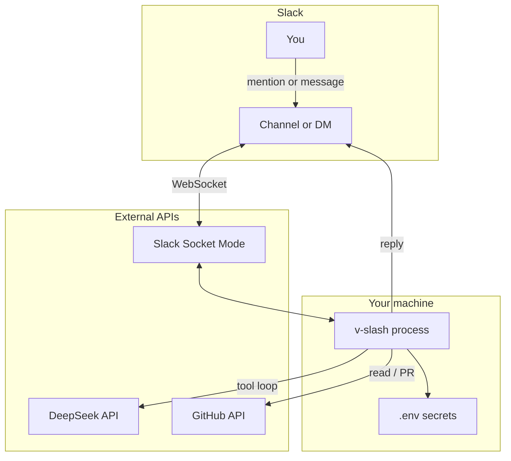
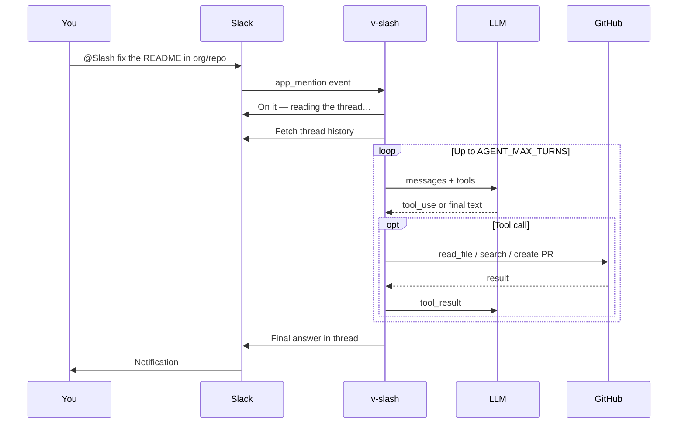
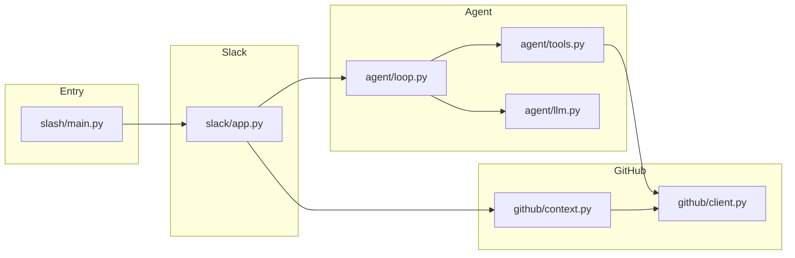
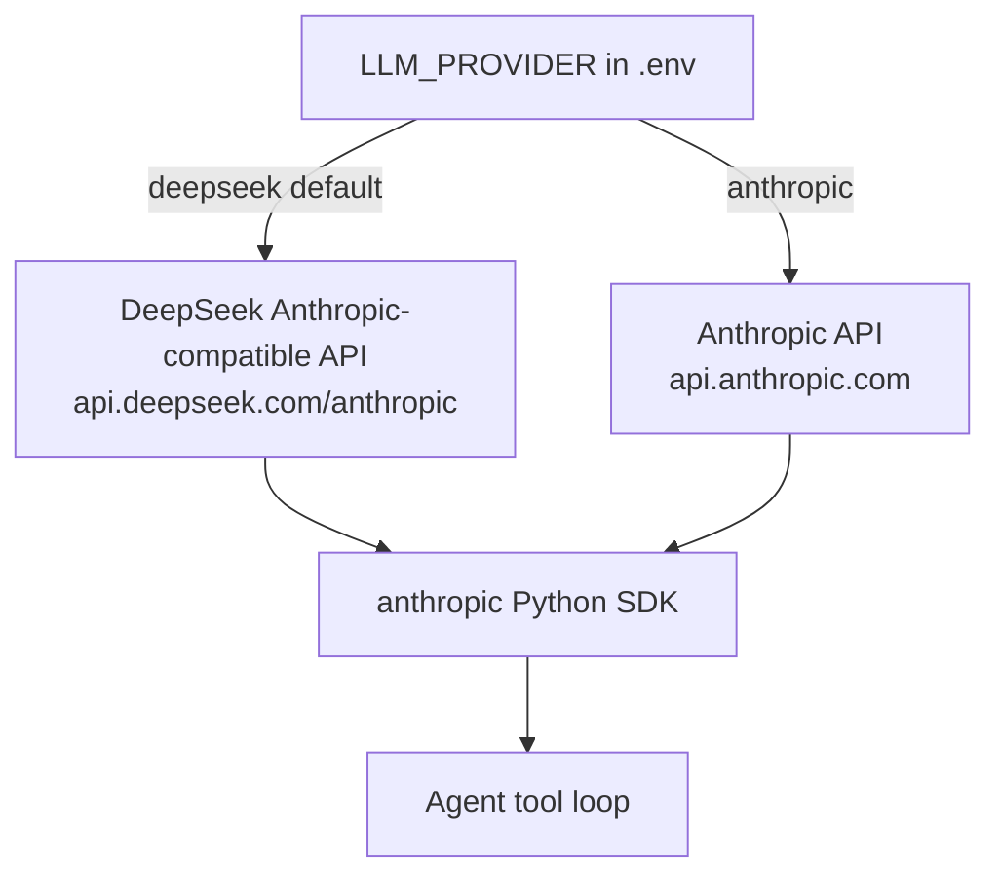
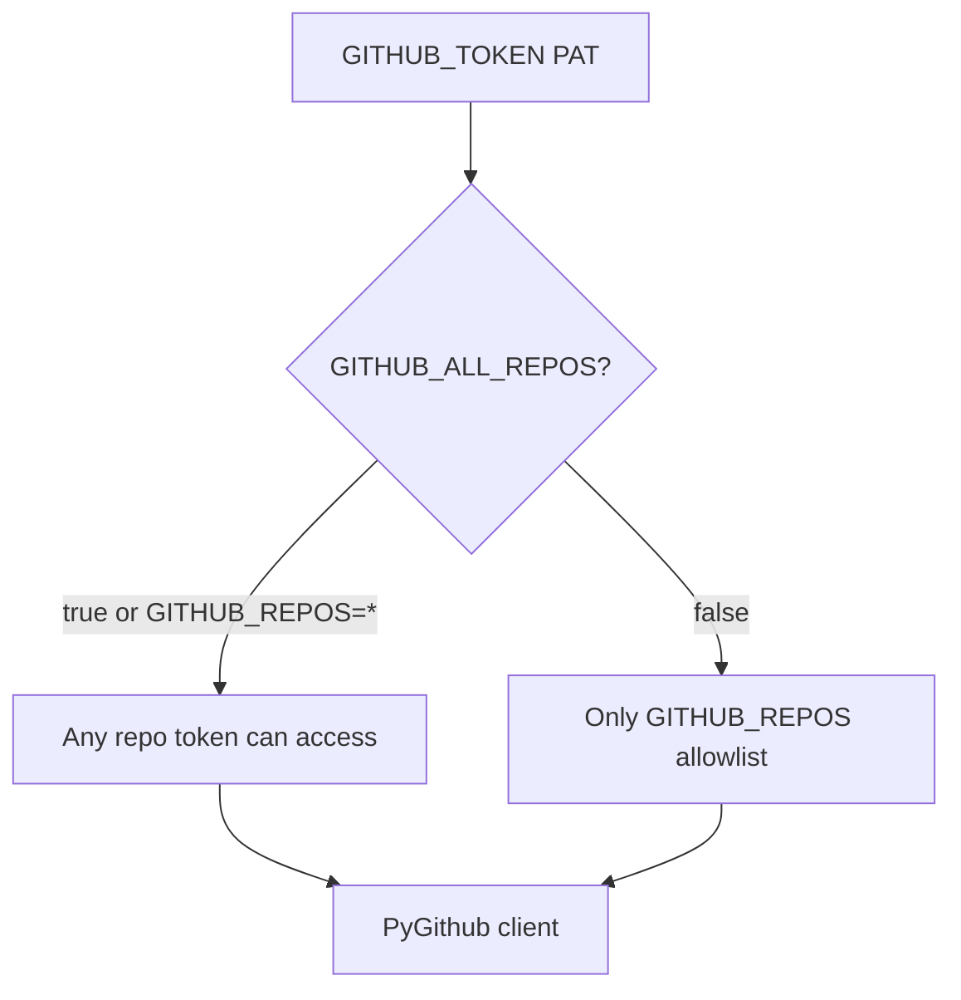

# v_slash

A personal [**Slash**](https://x.com/shashank_kr/status/2056246734465253859)-style assistant: mention it in **Slack**, it reads your **GitHub** repos, answers questions, reviews PRs, and can open small PRs.

Built for one developer (your tokens, your repos) — not multi-tenant.

## Features (MVP)

| Capability | Status |
|------------|--------|
| `@mention` in Slack channels | ✅ |
| DM the bot (no `@` required) | ✅ |
| Continue thread without re-mentioning | ✅ |
| Read files / list directories | ✅ |
| Code search (GitHub API) | ✅ |
| Summarize a PR by number | ✅ |
| Open a PR with file changes | ✅ |
| All repos or allowlist | ✅ |
| DeepSeek (default) or Anthropic | ✅ |
| Full codebase index / K8s / incidents | 🔜 roadmap |

## System overview



## Request flow (one message)



## Code layout



## LLM providers



| Provider | Default model | When to use |
|----------|---------------|-------------|
| `deepseek` | `deepseek-v4-flash` | Cheapest; needs [platform balance](https://platform.deepseek.com/) |
| `anthropic` | `claude-haiku-4-5` | Alternative; pay-per-token on [Console](https://console.anthropic.com/) |

## GitHub access modes



## Prerequisites

- Python 3.9+
- [Slack app](https://api.slack.com/apps) with **Socket Mode** enabled
- [GitHub PAT](https://github.com/settings/tokens) with `repo` scope
- [DeepSeek API key](https://platform.deepseek.com/) (default) — or Anthropic

## Quick start

```bash
git clone https://github.com/YOUR_USER/v_slash.git
cd v_slash
python3 -m venv .venv
source .venv/bin/activate
pip install -U pip hatchling
pip install -e .

cp .env.example .env
# Edit .env — save the file (⌘S) before running

v-slash
```

Expected output:

```text
v_slash is running (Socket Mode). Mention the bot in Slack to start.
Slack bot connected as @your-bot ...
```

When you message the bot, the terminal should log:

```text
Dispatching app_mention ...
Running agent for thread ...
Replied in thread ...
```

## 1. Slack app setup

1. [api.slack.com/apps](https://api.slack.com/apps) → **Create New App** → **From scratch**
2. **Socket Mode** → Enable → App-Level Token with `connections:write` → `SLACK_APP_TOKEN` (`xapp-...`)
3. **OAuth & Permissions** → Bot Token Scopes:
   - `app_mentions:read`, `channels:history`, `channels:read`, `chat:write`
   - `groups:history`, `im:history`, `mpim:history`, `users:read`
4. **Event Subscriptions** → Enable → Bot events:
   - `app_mention`, `message.channels`, `message.groups`, `message.im`
5. **Install App** → copy `SLACK_BOT_TOKEN` (`xoxb-...`)
6. **Reinstall App** after any scope/event change
7. In a channel: `/invite @YourBot`

### Bot not replying?

| Symptom | Fix |
|---------|-----|
| No `Dispatching ...` in terminal | Add bot events; reinstall app; save `.env` |
| `not_in_channel` in Slack | `/invite @YourBot` in that channel |
| Channel: no response | Use `@YourBot`, not plain text |
| DM: no response | Subscribe to `message.im` |
| `402 Insufficient Balance` | Top up [DeepSeek](https://platform.deepseek.com/) or switch to Anthropic |

## 2. GitHub

1. [github.com/settings/tokens](https://github.com/settings/tokens) → classic PAT → scope **`repo`**
2. Repo access in `.env`:

```bash
# All repos your token can access
GITHUB_ALL_REPOS=true

# Or allowlist only
# GITHUB_REPOS=your-user/repo-a,your-user/repo-b
```

## 3. Environment variables

| Variable | Required | Description |
|----------|----------|-------------|
| `SLACK_BOT_TOKEN` | Yes | Bot OAuth token (`xoxb-...`, ~50+ chars) |
| `SLACK_APP_TOKEN` | Yes | App-level token (`xapp-...`, Socket Mode) |
| `GITHUB_TOKEN` | Yes | `ghp_...` or `github_pat_...` |
| `GITHUB_ALL_REPOS` | No | `true` = full PAT access |
| `GITHUB_REPOS` | If allowlist | `owner/repo` list, or `*` |
| `GITHUB_MAX_REPOS_LIST` | No | Cap for `list_repos` (default `200`) |
| `DEEPSEEK_API_KEY` | Yes* | *When `LLM_PROVIDER=deepseek` |
| `LLM_PROVIDER` | No | `deepseek` (default) or `anthropic` |
| `AGENT_MODEL` | No | `deepseek-v4-flash` or `deepseek-v4-pro` |
| `DEEPSEEK_BASE_URL` | No | Default `https://api.deepseek.com/anthropic` |
| `ANTHROPIC_API_KEY` | If Anthropic | When `LLM_PROVIDER=anthropic` |
| `AGENT_MAX_TURNS` | No | Tool loop limit (default `12`) |

See [`.env.example`](.env.example) for a full template.

## Example prompts

```
@Slash list my repos
@Slash explain how auth works in your-user/your-repo
@Slash review PR 42 in your-user/your-repo
@Slash fix the typo in README title and open a PR for your-user/your-repo
```

In a **thread** under an `@mention`, you can reply without `@` again.

## Security

- Never commit `.env` (included in `.gitignore`)
- `GITHUB_ALL_REPOS=true` grants access to every private repo the PAT can reach
- Prefer a dedicated PAT; rotate if leaked
- Start with low-risk repos until you trust automated PRs

## Roadmap

- [ ] GitHub App instead of PAT
- [ ] PR review comments on GitHub
- [ ] Local clone + ripgrep for faster search
- [ ] Skills: tests, linters, deploy hooks
- [ ] Deploy 24/7 (Fly.io / Railway / VPS)

## License

MIT
